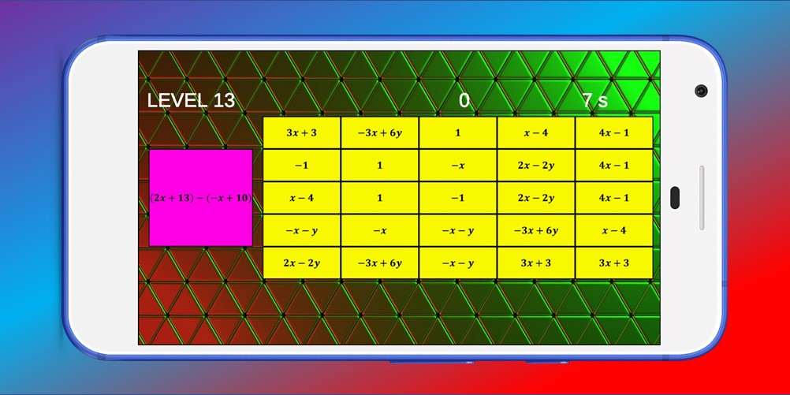
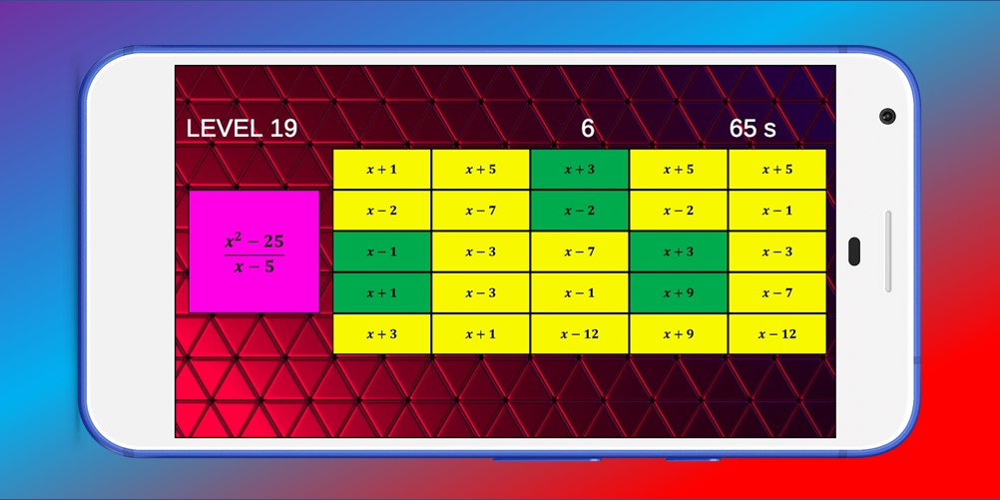
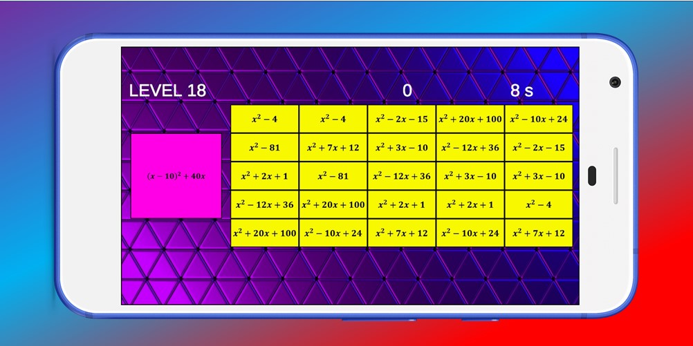
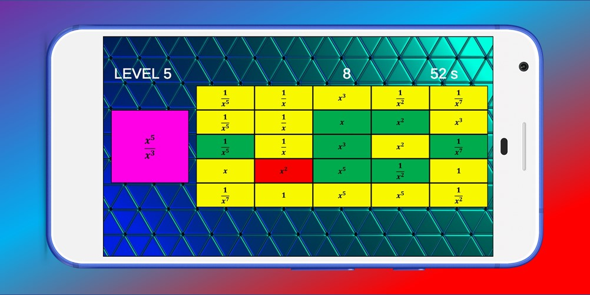
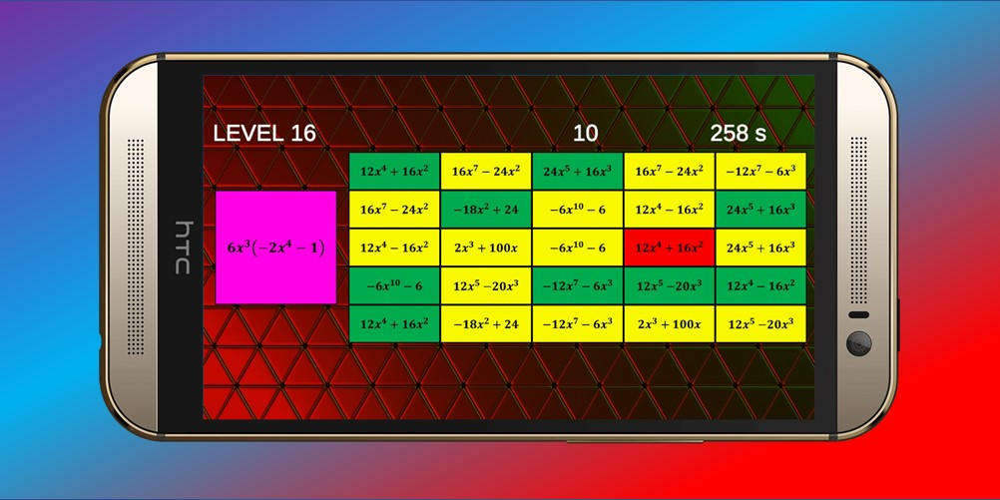
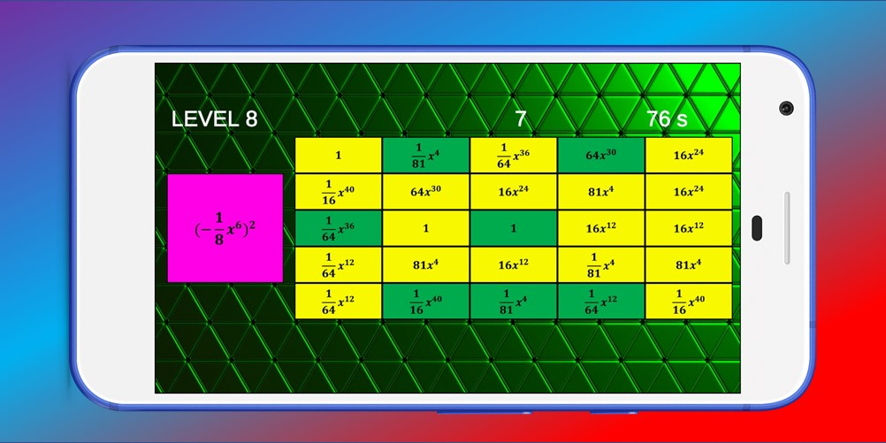
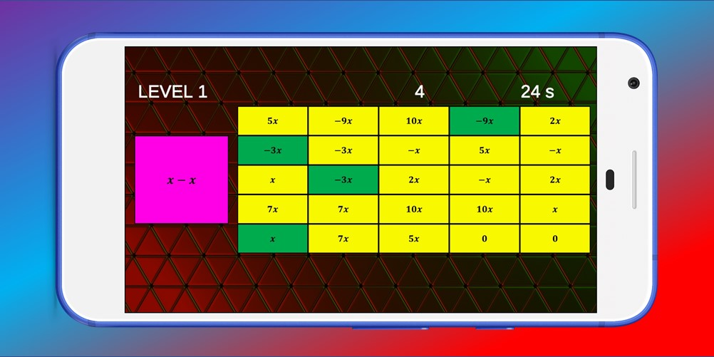

# Polynomial Bingo

Welcome to Polynomial Bingo, a fun and interactive game designed to help you practice polynomial arithmetic! This game is perfect for all math enthusiasts looking to enhance their skills with polynomials.

## Game Description

Polynomial Bingo combines the traditional bingo game with polynomial calculations. In this game, players perform various mathematical operations on polynomials, including:

- Addition
- Subtraction
- Multiplication
- Division
- Exponentiation

The objective of the game is to fill a 5x5 grid with the correct answers. Players are presented with a polynomial calculation and must find the solution in the grid. When a player finds the correct answer, they mark it on their grid. The winner is the player to complete a horizontal, vertical, or diagonal line.

## Game Features

- 20 Levels: The game consists of 20 challenges that increase in difficulty. Each level presents different polynomial calculations to help you improve your skills.
- Interactive Interface: An easy-to-use interface makes gameplay smooth and enjoyable.
- Learning Through Play: The game allows you to learn polynomial arithmetic without stress, and you can play at your own pace.

## How to Play

- Start the game and select a level.
- Solve the presented polynomial calculation.
- Find the answer in the 5x5 grid and mark it.
- Continue playing until you complete a horizontal, vertical, or diagonal line.

## Additional Information

If you have any questions or suggestions, feel free to open issues.

Now it's time to put your math skills to the test and enjoy learning through gameplay! Good luck!

## Screenshots

## Also available for Android devices

